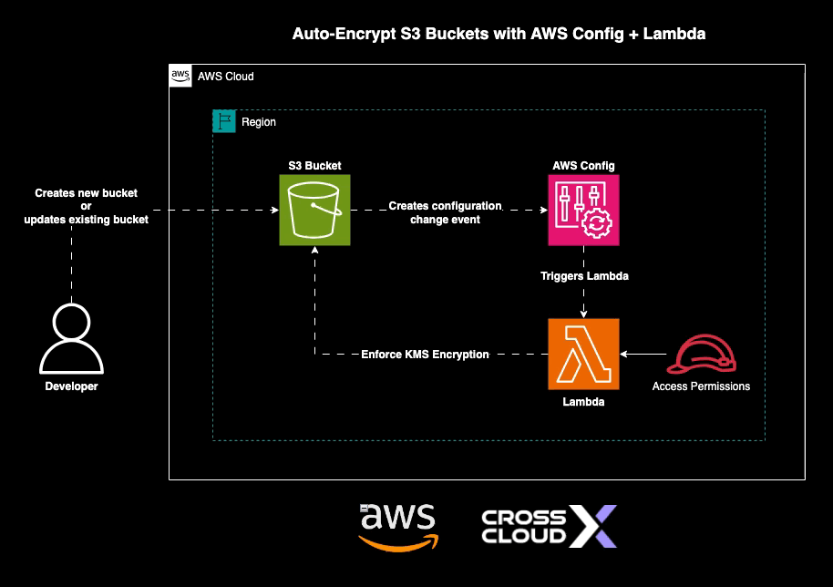

# 🔐 Auto-Remediation for S3 Buckets with Terraform



A Terraform project that automatically detects and fixes common S3 bucket security issues using AWS Config and Lambda.

## 🚀 Features

- **🛡️ Security Automation**:
  - Detects unencrypted S3 buckets
  - Identifies buckets with public access
  - Auto-remediates non-compliant resources

- **⚙️ Infrastructure as Code**:
  - Complete AWS environment deployment
  - Customizable security rules
  - Demo vulnerable bucket creation

- **🔍 Monitoring**:
  - AWS Config integration
  - Custom compliance rules
  - Detailed evaluation logging

## 📂 Repository Structure

```bash
.
├── 01-s3-bucket.tf          # Secure S3 bucket for logs
├── 02-iam-role.tf           # IAM roles and policies
├── 03-config.tf             # AWS Config setup
├── 04-lambda.tf             # Remediation Lambda function
├── 05-s3-vulnerable.tf      # Demo vulnerable bucket
├── Makefile                 # Automation commands
├── demo.tfvars              # Demo configuration
├── drawio/                  # Architecture diagrams
├── src/                     # Lambda source code
│   ├── index.py             # Main remediation logic
│   └── python.zip           # Compiled Lambda package
├── variables.tf             # Configuration variables
└── versions.tf             # Terraform version constraints
```

## 📋 Makefile Quick Guide

```bash
# 🧹 Clean & Init
make clean       # Remove temp files
make tf-init     # Init Terraform

# 🔄 Plan/Apply/Destroy
make tf-plan     # Generate plan
make tf-apply    # Apply changes
make tf-destroy  # Remove all resources

# 📊 Outputs & Costs
make tf-output   # Show outputs
make infracost   # Estimate costs
make infracost-html  # Generate HTML cost report

# ⚙️ Usage Examples:
AWS_PROFILE=your-profile make tf-plan env=dev
make tf-apply env=prod

# 🔥 Important:
# - Always review plan before apply
# - Uses AWS_PROFILE=scc-aws by default
# - Automatically loads *.tfvars files
```